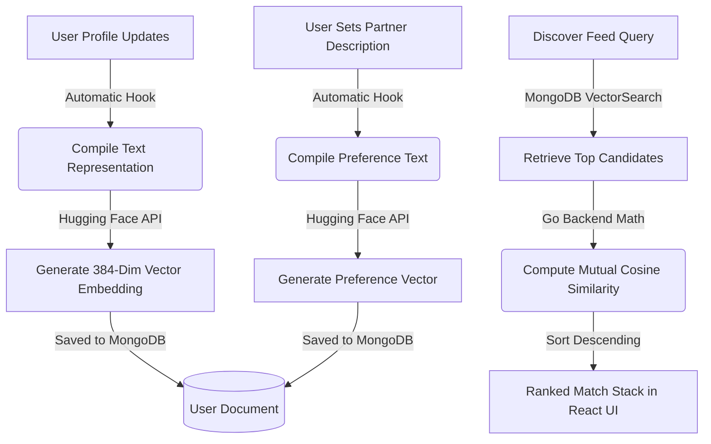

# Church-Match Project Updates & AI Recommender Documentation
*Date: June 16, 2026*

This document outlines the major updates, architecture details of the AI Recommender, bug fixes, and environment configurations implemented today for the **Church-Match** application.

---

## 🧠 1. AI Recommender System (Partner Preference Matching)
We transitioned the matching engine from simple database filtering to **Natural-Language Vector Semantic Matching** using Sentence Embeddings and **Mutual Compatibility Scores**.

### The Core Architecture
Instead of rigid filters (e.g. strict age or denomination checks), users can now write in their own words what they seek in a partner. 



### The Math: Mutual Compatibility Scoring
For any two users, **User A** and **User B**, the recommendation engine calculates how well they align mutually:

1. **Preference Compatibility A ➔ B:** The Cosine Similarity between User A's *Preference Vector* and User B's *Profile Vector*.
2. **Preference Compatibility B ➔ A:** The Cosine Similarity between User B's *Preference Vector* and User A's *Profile Vector*.
3. **Mutual Score:** The average of these two similarities:
   $$\text{Mutual Compatibility Score} = \frac{\text{Similarity}(A_{\text{pref}}, B_{\text{profile}}) + \text{Similarity}(B_{\text{pref}}, A_{\text{profile}})}{2}$$

This ensures that the matches shown at the top of the stack are highly compatible in **both** directions.

### Codebase Changes
*   **Model Schema Update (`models/user.go`):** 
    *   `partner_pref_text`: Stores the raw text description.
    *   `partner_pref_embedding`: Stores the 384-dimensional vector.
*   **Vector Pipeline (`services/embedding_service.go`):** Connects to the Hugging Face `sentence-transformers/all-MiniLM-L6-v2` model.
*   **Profile Save Hooks (`services/profile_service.go`):** Updates to bio, preferences, or age ranges run an asynchronous goroutine to automatically update vectors.
*   **Ranking Engine (`repositories/user_repository.go`):** Custom Go implementation of Vector Cosine Similarity and mutual score sorting.
*   **UI Input Card (`FiltersScreen.tsx`):** Added a premium, modern text area with a sparkles icon allowing users to write their ideal partner preferences.

---

## 🛠️ 2. Core Bug Fixes

### A. Discovery Feed Exclusions (`swipe_service.go`)
*   **Old Behavior:** If User A liked (swiped right on) User B, User A was excluded from User B's discover feed, making mutual matching impossible unless they checked a separate likes list.
*   **Fixed Behavior:** Swiping right keeps the user visible to the recipient. When User B sees User A and swipes right, the system triggers a mutual match instantly.

### B. Prayer Wall Double-Amen Count (`prayer_repository.go`)
*   **Old Behavior:** Clicking the "Amen" button multiple times could increment the counter infinitely.
*   **Fixed Behavior:** Implemented MongoDB `$addToSet` for user tracking. The total count matches the size of the unique `amens_by` array, preventing duplicate increments.

---

## 🔒 3. Git Security & Ignore Rules
We resolved a blocked GitHub push caused by security keys and bloated files in the commit history:

1.  **Removed Sensitive Tracking:** Used `git rm --cached` to stop tracking `.env` and local `.exe` binaries while keeping them intact locally.
2.  **Updated `.gitignore`:** Configured Git to permanently ignore:
    ```text
    .env
    firebase-admin.json
    *.exe
    ```
3.  **Clean Push:** Successfully pushed the codebase to remote `master`.

---

## ☁️ 4. Render Hosting & Deployment Checklist
Because credentials and config files are no longer pushed to Git, the live server on Render needs the following manual configurations:

1.  **Environment Variable (`Hugging_Face_Key`):**
    *   **Dashboard Path:** Go to your Render Web Service ➔ Environment ➔ Environment Variables.
    *   **Value:** Enter your Hugging Face API User Access Token (`hf_...`).
2.  **Secret File (`firebase-admin.json`):**
    *   **Dashboard Path:** Go to your Render Web Service ➔ Environment ➔ Secret Files.
    *   **Filename:** `firebase-admin.json`
    *   **Content:** Copy the entire JSON credentials block from your local `firebase-admin.json` file.

---

## 🗄️ 5. Database Reset Script
To clear test data and start fresh during testing cycles, we created a utility script:
*   **Command:** `go run cmd/resetdb/main.go`
*   **Action:** Connects to your live MongoDB Atlas Cluster and wipes the `users`, `swipes`, `matches`, `messages`, `prayers`, and `reports` collections safely.
